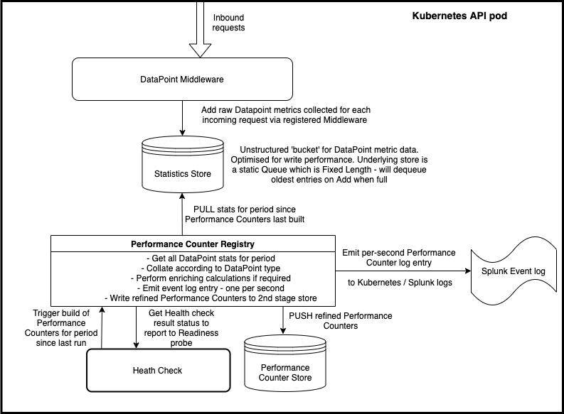

# Health Checks
Kubernetes has a Health Check feature to determine the health of individual pods 
and decide whether they are in a state to be fed incoming requests by the load balancer. 
[Kubernetes Health Check details here](https://kubernetes.io/docs/tasks/configure-pod-container/configure-liveness-readiness-startup-probes/).
The configuration of these Health checks (e.g. frequency, timeout) can be viewed in the 'values.yaml' file in this solution in the 'probes' section.

We have created additional custom 'Performance Counter' Health Checks to piggyback on this framework. 
Currently this Health Check process is used to build the Performance Counters 
(as it provides us with a periodic 'hook' process), emit these to the logs and then check the results. Note that
this does not need to be the case - e.g. the Performance Counter builder could run continuously on a background loop.

**_Note: the current deployed state of the Performance Counter Health Checks is to enable the Metric Logging to Splunk, 
but to disable the actual Health check from returning a state other than Healthy 
i.e. they are not influencing the Health status of the pods. We are currently focussing on other areas for 
performance improvements and the Performance Counter metrics are useful to facilitate this, 
but the actual Health check is not yet required._**

## Logical Architecture


##Key areas of the Performance Counter code:
Code is located in the 'NHSOnline.Backend.AspNet' project in the main NHSApp codebase.
- Disable/Enable Performance Counters & Health Checks via configuration boolean flags:
    - IsMetricLoggingEnabled: this controls whether the Performance Counter metrics are captured and Performance counter log events emitted
    - IsHealthCheckEnabled: this controls whether the Performance Counter Health Checks will be executed to determine Readiness status of the pod.
    NOTE: As the Health check code also is currently responsible for building the Performance counters, 
    this 1st stage of the process will by unaffected by this setting (it is controlled by the previous flag).
- Middleware.PerformanceCounter directory:
    - Registers the Performance Counter middleware to record the required metrics at the desired stage of the request lifecycle. 
      If you require a new metric to record another feature of inbound requests, add the code here.
- HealthChecks directory:
    - Currently the Performance Counters are build and emitted to the logs as part of the overall Kubernetes HealthCheck process. 
      If this changes, these files can be re-organised. 
- HealthChecks.PerformanceCounter directory:
    - DataPoints: a DataPoint represents the basic metric we wish to capture for measurement.
    - DataPointType.cs: if you add a new Performance Counter, it can re-use existing DataPoint(s), but at a minimum
      it will require its own entry in this enum as this is used as the key for subsequent processing. 
      The 'Description' attribute on these enum entries is used as the key in the emitted log entry for the counter.
    - PerformanceCounterServiceExtensions.cs – register all services in DI with the desired lifetime. 
      Note that Singleton services are scoped ‘pod-wide’ as this is the base unit of infrastructure in a deployed AKS service. 
      This file is also where the PerformanceCounter health check is added to the existing NhsAppHealthChecks registry 
      with the ‘Readiness’ tag to run as part of the Kubernetes Readiness cycle.
    - PerformanceCounterHealthCheck.cs – this is the main entry point to both build the Performance Counters 
      for the intervening period since the last run and also to subsequently evaluate these to determine the Health status 
      of the current Kubernetes pod.
    - PerformanceCounterRegistry.cs - takes the raw captured metrics from the StatisticStore and performs refinement. 
    Performs additional actions e.g. emitting log events before persisting the refined PerformanceCounters to the 2nd state store.
    - StatisticsStoreService.cs - the 1st stage store. Holds the raw metrics collated from incoming requests by the Middleware methods.
    - PerformanceCounterStoreService - the 2nd stage store. Holds the refined PerformanceCounters which can be subsequently 
      queried for e.g. determining Health status.

## Kubernetes logs
The Performance Counter log messages are emitted via the standard Kubernetes logs. We currently view these in Splunk.
A typical Splunk query to check performance counter messages is as follows:
```
kubernetes_namespace=loadtest kubernetes_node_labels="kubernetes.azure.com/cluster=*loadtestuks1*" sourcetype=kubernetes_logs
kubernetes_pod_name=nhsapp-api*
"PerformanceCounter Metric"
| eval _time=epochSeconds
| timechart span=1s sum(numberOfRequests) by kubernetes_pod_name useother=false
```

You can see that this will show the emitted counters for 'numberOfRequests'. 
A counter is emitted for each second, so we can map our emitted 'epochSecond' to the Splunk _time keyword.
Other performance counters such as 'averageResponseTimeInMs' can be viewed. 
To see what else is available to plot, just view the raw Splunk events. 
All counters for each second are emitted in the same log event.