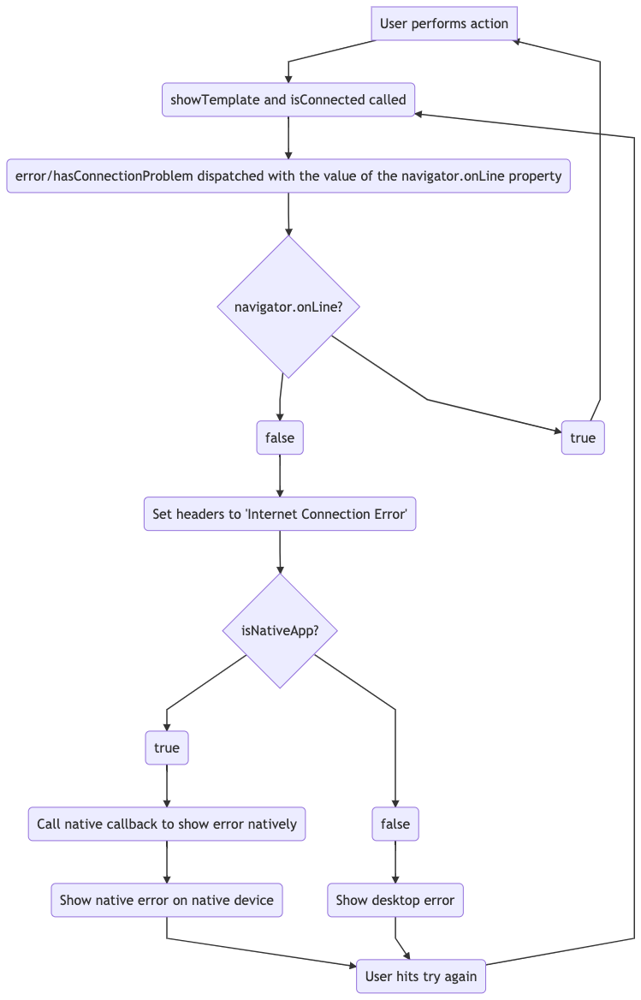

# Frontend Error handling

Within the nhs app we need to handle if the user has turned off their internet connectivity and show a message informing them.

In the frontend there this is handled using the `navigator.onLine` property in the `DefaultMixin.vue` file. As this is a mixin it can be used in any other vue files within the app without having to be imported.

Within this `DefaultMixin.vue` file there is a `showTemplate()` computed property and an `hasConnectionProblem()` method.

The `showTemplate()` handles the hiding of content if there are apiErrors or if there is no internet connectivity. It calls the `hasConnectionProblem()` method for the latter.

Currently within the app we call `showTemplate()` from every page. Ideally we would want this to be handled without having to explicity call it every time.

## Api error handling

The apiErrors are handled within the api file if an error has occured this can be ignored by setting the `ignoreError` property to true in the request parameters. Or in some cases that action is dispatched outside of the api service. For example in the prescriptions `load()` action.

Various information is obtained from the error response in the `ADD_API_ERROR` mutation before pushing it to an array.

Within the `ApiError.vue` component the locale is looked up based on the component and the status and errors codes. For example if the component the error occured in was prescriptions/view_orders and the status code was 504, the header string would be obtained by combining those values and the resulting locale string would be `apiErrors.components.prescriptions.view_orders.504.header`. The component value is obtained by manipulating the path value from the $router in the `component` computed property logic within `ApiError.vue`

The above example would be the most specific lookup. It gradually gets less specific if nothing is returned for the previous lookup. The most generic lookups are by status code instead of component. So if a 500 error occurs, for example and there is no specific error for any of the individual journeys it will eventually try to lookup they key `apiErrors.500.{type}`. In the case above `{type}` is replaced with header but could also be message, subHeader, pageTitle, pageHeader or additionalInfo. If nothing is returned from this still the last lookup ran is `apiErrors.{type}`.

Within the appointments journey the error handling is done within that area of the application. In the myAppointments and availableAppointments actions there is a `createError` method which is called if an error is caught. There are other error components for appointments such as `GpAppointmentErrors.vue` and `BookingErrors.vue`.

Within prescriptions only if the api error has a status code of 599 (gp system unavailable) is the error then handled within prescriptions and not by the `ApiError.vue` logic.

## Internet connection error handling
In the `hasConnectionProblem()` method it makes use of the `navigator.onLine` property and dispatches a store action based on that value.

Within that action (`errors/setConnectionProblem`) if the value is true then it sets the header and also calls a callback to the native apps to show the native internet connection error.

The component which gets used is `ConnectionProblem.vue` and within that file there is a condition which shows the content if the `hasConnectionProblem` value in the store is true and the app is not native. This component is only shown on the desktop version of the app as on native we have native no connectivity errors.

On the native apps the internet connectivity is checked on every page load within the webviews.

However in the vuejs code we sometimes render new content based on an `v-if else` which is not a page load. Most notably with the health record warning page. Once the user hits accept it sets a boolean value and the medical record is shown on the same page. 

So to address this within the `errors/setConnectionProblem` action  when the connectivity is turned off in this area the callback will fire and the native connection error will still show on the native apps.

Internet connection error diagram:

