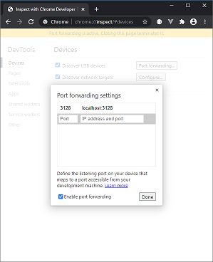
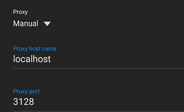

# Access local services from physical Android device

To test local changes against a physical Android device the device needs to be able to access the services running under docker on the local machine. To do this we run a proxy server in the docker network.

## Configure the Android device to use the proxy server

### Host

1. Ensure that your Android device is connected to your via usb
2. Open Chrome and navigate to `chrome://inspect`
3. Click on "Port forwarding..."
4. Forward port `3128` to `localhost:3128` and ensure "Enable port forwarding" is selected

   

5. Click "Done"

Keep the page open to ensure port forwarding continues.

### Android Device

1. Open device settings
2. Go to wifi settings and click your current network
3. Click `Advanced`
4. Click on `Proxy` and select `Manual`
5. Set `Proxy host name` to `localhost`
6. Set `Proxy port` to `3128`

   

7. Click `Save`

### Testing

Once this configuration has been done navigating to `http://localhost:3128/` in Chrome should show a not found page from squid. If this is fine then run your make command and run the app.

## Start services with proxy

Add `PROXY=true` to your `make run...` command to start the service with the proxy

e.g.

```bash
make run PROXY=true
```

or

```bash
make run-dev-stubs PFSAPI=host PROXY=true
```
