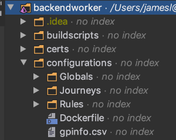
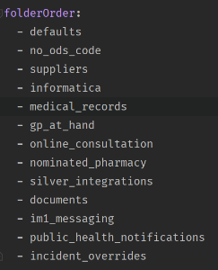
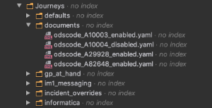
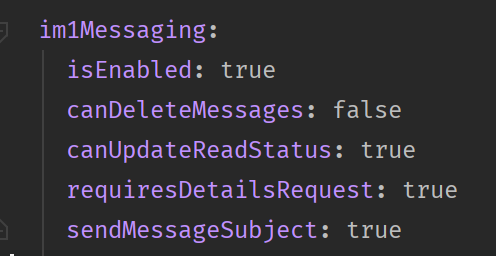

# Configure Service Journey Rules

## Introduction
The service journey rules configuration within the backendworker allows for certain features to be turned on and off for specific GP suppliers and GP practices using their ODS code. It also allows for different GP supplier behaviours to be catered for without having to handle this logic on the front end.

The configurations are within the configurations folder in the backendworker:

The majority of changes to SJR configuration will be done within the Journeys folder. This folder contains mostly feature specific folders which in turn contain the `.yaml` files for each configuration:

The features which can be configured within here include Medical Record Documents, GP Surgery Messaging, Medical Record versioning, Online Consultations, Nominated Pharmacy and Patients Know Best(PKB). Some non feature folders are:

- `defaults` which holds the configuration which is a fallback if there is no other configuration specified at a supplier level or ODS code level.
- `suppliers` which holds the configuration based on the GP supplier this is also a fallback if there is no configuration for a supplier specific ODS code. For example if EMIS had a XXXXXX code and documents was turned off in the `emis_supplier.yaml` file in this folder and there was no `odscode_XXXXXX_enabled.yaml` to enable it it would always be off.
- `no_ods_code` which holds the configuration if the user has no ODS code.

The other folders in the configurations folder are Rules and Globals. Currently the Rules folder holds the file (`rules.yaml`) which determines the ordering in which the SJR rules are read with the configurations overwriting each other as they are read in. For example if in the defaults there was a rule which turned GP Surgery Messaging off and in the `im1_messaging` folder a configuration which turned it on as the `im1_messaging` folder is after the defaults in the `folderOrder` it would be turned on:

The `Globals` folder currently holds `PublicHealthNotifications` which contains html for a warning message to do with COVID-19. This setup allowed for information to be changed on these notifications without a full release which means less time getting an informative health message out to users if government advice where to change during the pandemic. In the Journeys folder there is a `public_health_notifications` folder which holds a configuration .yaml file excluding the message from the ODS codes A00002 and A10006.

One of the files in this folder is `gpinfo.csv` this file is useful if you are wanting to find out which supplier an ODS code belongs to. Just search for the ODS code in this file.

## Example: Turning off GP surgery Messages for an EMIS user
Say you wanted to test that GP Surgery Messages was not accessible in the app when the user did not have it turned on.

- If you know the ODS code of that user, for example if it was A29928, navigate to the folder `configurations > im1_messaging > odscode_A29928_enabled.yaml` and change isEnabled from true to false.

- Alternatively if you did not know the ODS code of the user you could make the same change above but in the `configurations > suppliers > emis_supplier.yaml` (changing isEnabled under im1Messaging in that file). However this may not do what you want as if the ODS code of that user is specified to turn on GP Messaging your change in `emis_supplier.yaml` will be overridden and it will remain turned on.

- Once changed commit and push the change to the relevant branch (preferably using a separate commit so it is easier to revert before merge) and deploy the PR and hopefully it should now be inaccessible for that user.

## Catering for different supplier behaviour through SJR rules.

Due to the need of the NHS app to integrate with a range of different suppliers. Different suppliers of course have different functionality for the same area. The best example of using SJR to determine how the front end should handle these differences is in GP Surgery Messaging.

Under `im1Messaging` in a yaml file there are other properties as well as `isEnabled`. 

Take `sendMessageSubject` as an example. When a patient sends a message using the EMIS system a subject is required, so for EMIS ods codes and in `emis_supplier.yaml` it is set to true. TPP does not need a subject to send a message so we then turn it off in the TPP SJR configuration files. 

The same goes
for the `requiresDetailsRequest` property, EMIS requires an extra API call to retrieve more details about a message but TPP responds with all the information to populate the front end from the initial API call so we use this property to determine the web behaviour.