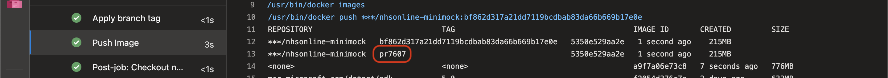
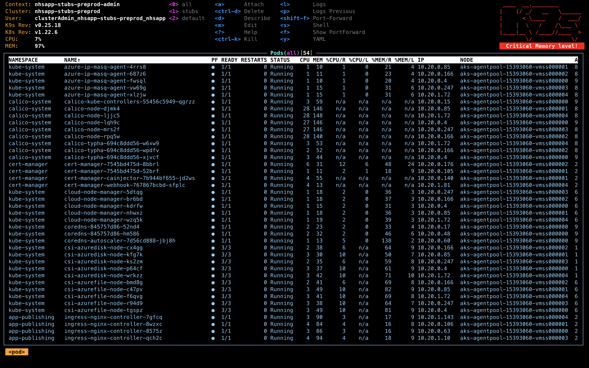
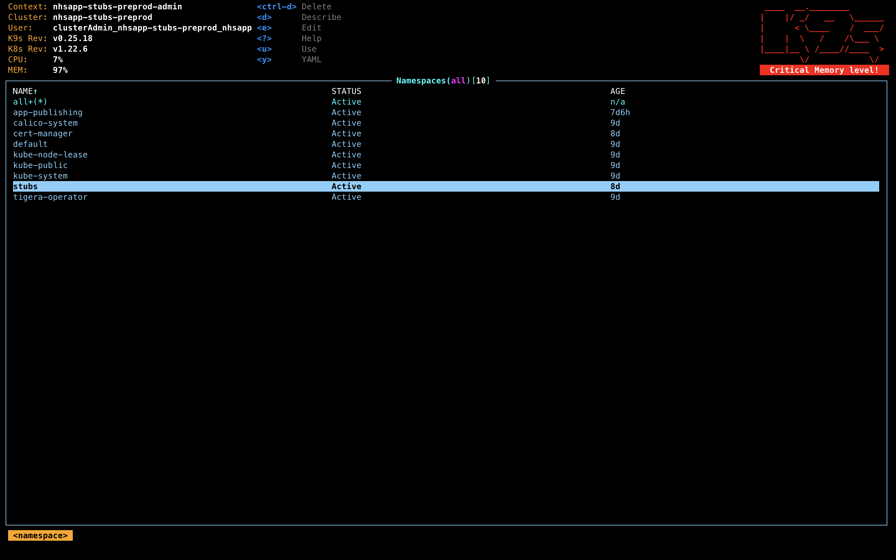
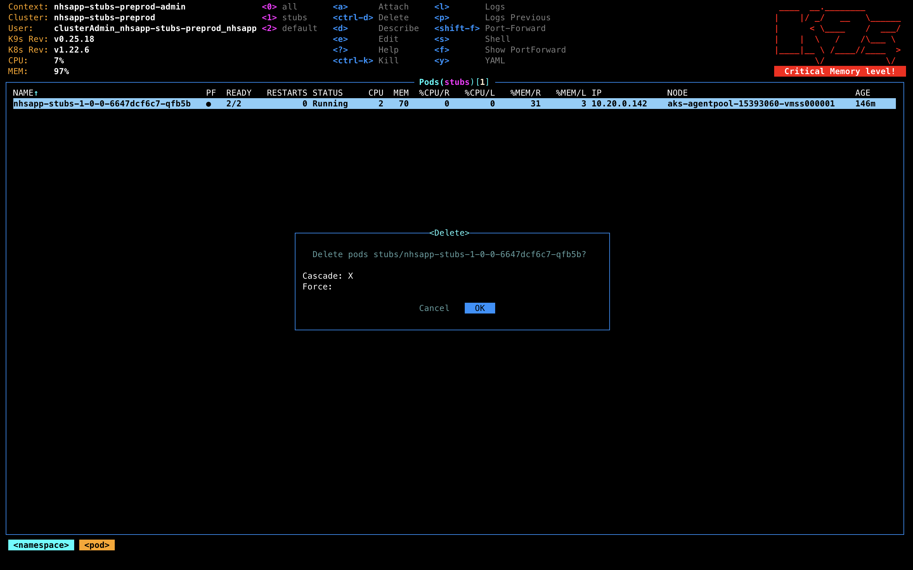
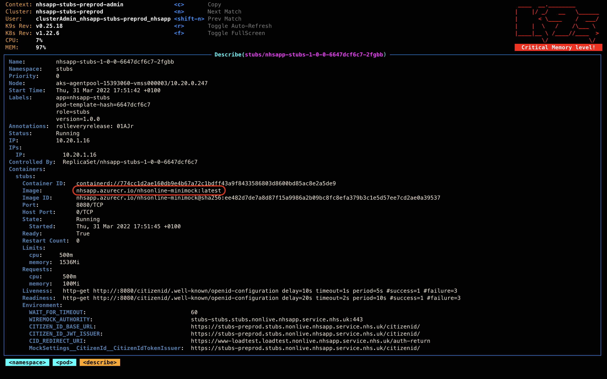

# Stubbing Minimocks and Deploying to Pre-Prod Stubs Environment

During the initial development phase of the Wayfinder/Secondary Care/&lt;insert other name here&gt; work, we needed
a way to easily stub an external API to use for development whilst the actual Aggregator API specification was
being finalised.

It was decided the easiest way to do this was to take the existing Minimock solution, and host it on a dedicated
environment.

## Updating and Deploying the Minimocks to Pre-Prod Stubs Environment

Update the [nhsapp-minimock](https://dev.azure.com/nhsapp/NHS%20App/_git/nhsapp-minimock) repo accordingly.

Ensure the [nhsapp-minimock CI](https://dev.azure.com/nhsapp/NHS%20App/_build?definitionId=24&_a=summary) has ran with your changes. Manually kick it off if not.

**[NOTE]**: You only need to do one of the following; run the helm upgrade ***OR*** delete the pod.

### Helm Upgrade (when the tag you want to deploy has changed)

From the CI run, if not from the develop branch (in which case just use `latest`), get the image tag from the **Push Image** step.



Checkout the branch `nhsapp/feature/ops-0000-stub-changes`.

Update the `image_tag` in ***nhsapp/nhsapp-chart/nhsapp-stubs/values.yaml*** with the tag obtained from the **Push Image** step above.

Ensure you have helm CLI installed. If not run:

```brew install helm``` 

in a terminal window, and from the ***nhsapp/nhsapp-chart/nhsapp-stubs*** directory, run:

```helm upgrade nhsapp-stubs-develop .```

### Delete currently running pod (when the tag being deploy hasn't changed, but the underlying image has)

You'll need to delete the running pod on `nhsapp-stubs-preprod` environment in the `stubs` namespace. \
*See [Azure Kubernetes CLI Commands](./azure-kubernetes-cli-commands.md) for details on how to connect via kubectl.*

If you've got [k9s](https://k9scli.io/topics/install/) installed, follow the steps [here](./azure-kubernetes-cli-commands.md) to get the credentials for the `nhsapp-stubs-preprod` environment, then run:

```k9s```



Type ```:namespace``` (which should bring up an input/autocomplete above the listed pods)

Choose the `stubs` namespace:



```ctrl + d``` to delete the pod and select ```OK```



You should see a new pod be recreated immediately by Kubernetes, and if you describe it (highlighting the pod and pressing ```d```) you should see the **Containers.stubs.Image** property set accordingly.



## Using the Minimocks from the PFS API

When running locally, you can either use what's deployed to the dedicated environment (if your changes are deployed there) or run the stubs locally yourself.

### Using Pre-Prod Stubs

Update the ```SECONDARY_CARE_AGGREGATOR_BASE_URL``` in [secondarycare_connectivity.env](https://dev.azure.com/nhsapp/NHS%20App/_git/nhsapp?path=/docker/secondarycare_connectivity.env&version=GBdevelop&_a=contents) and set the domain to be ```stubs-preprod.stubs.nonlive.nhsapp.service.nhs.uk```

### Running Minimocks locally through Rider

Run everything, bringing up the proxy to forward `stubs.local.bitraft.io` traffic to the host machine:

```make run STUBS=host```

Simply run the Minimocks from Rider.

***Note: If you're running the PFS API through Rider, you do not need to run STUBS=host as the PFS API is running on the host machine.***