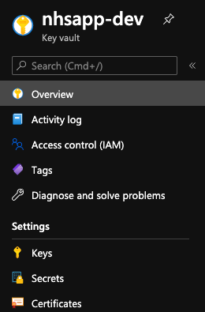

## Summary

Our .net codebase reads in PFX files (which are [digital key pairs](https://en.wikipedia.org/wiki/Public-key_cryptography) combined with a [public key certificate](https://en.wikipedia.org/wiki/Public_key_certificate)) which allow us to perform mutual authentication with our upstream systems such as TPP/NHS login/EMIS/Organ Donation.

We store these PFX files, along with our other secrets such as API keys, in an Azure Key Vault and use the [Azure Key Vault provider](https://github.com/Azure/secrets-store-csi-driver-provider-azure) for [Secret Store CSI (container store interface) driver](https://github.com/kubernetes-sigs/secrets-store-csi-driver) to retrieve secrets from our Azure Key Vault and mount them into containers in kubernetes.

## Key Vault usage



### Digital key pairs with or without certificates

We use the PFX format and upload them to our Key Vault as a "certificate". If the private key in the PFX file was encrypted with a password it is stripped at the time of upload.
Key Vault maintains this certificate abstraction for us and allows us to request either the private key, the public key, or the certificate component.
Key Vault will not allow expired certificates to be uploaded in this manner. See the workarounds below for how we cope with this when necessary.

### API keys

We upload our API Keys to our Key Vault as a "secret".

### Other secrets

It is possible to upload arbitrary data as a "secret", however this must be base64 encoded such that it remains a text-based format. The method by which we make these available in kubernetes allows us to decode from base64 on the fly before our application sees the secret.

### Workarounds

As Key Vault does not allow expired certificates to be uploaded we workaround this by utilising the method above. We base64 encode the PFX file and at the point that we're uploading it specify a "Content Type" of "application/x-pkcs12" to allow it to be treated as a PFX file.
As this bypasses the certificate abstraction we must ensure we've already removed the password from the PFX file.

## Secrets Provider Configuration

The secrets provider that takes the secrets from our Azure Key Vault and makes them available to our containers in kubernetes is configured in the [Helm Chart](../nhsapp-chart.md).

### SecretProviderClass

A `SecretProviderClass` is defined that contains details of which Key Vault to connect to and a list of objects to pull from said Key Vault.
In the snippet below we're pulling the `qualtricsApiKey` and the `tppPfx` objects.
We've also specified that the `qualtricsApiKey` should be synced with the Kubernetes secrets named `qualtrics-api-key-v1-41-0`, but the `tppPfx` object should not - the reason for this will be made clear further down when we look at how this `SecretProviderClass` is referenced from a pod.

The `tppPfx` object in the snippet has several extra parameters that instruct the secret provider to provide us with a file in PFX format (as opposed to PEM) and to base64 decode the file so that the raw PFX is available to us.

```yaml
---
apiVersion: secrets-store.csi.x-k8s.io/v1alpha1
kind: SecretProviderClass
metadata:
  name: nhsapp-staging-v1-41-0
spec:
  provider: azure
  secretObjects:
    - data:
        - key: apikey
          objectName: qualtricsApiKey
      secretName: qualtrics-api-key-v1-41-0
      type: Opaque
  parameters:
    useVMManagedIdentity: "true"
    keyvaultName: "nhsapp-staging"
    objects: |
      array:
        - |
          objectName: qualtricsApiKey
          objectType: secret
        - |
          objectName: tppPfx
          objectType: secret
          objectFormat: pfx
          objectEncoding: base64
    resourceGroup: "nhsapp-keyvault-live"
    subscriptionId: "xxxxxxxxxxxxxxxxxxxxxxxxxxxxxx"
    tenantId: "xxxxxxxxxxxxxxxxxxxxxxxxxxxxxx"
```

### Pod configuration

From within a deployment in the Helm Chart we can configure the pod to use the secrets defined above.
Firstly we define a volume that uses the secrets store driver and reference the above `SecretProviderClass` by name.
We then mount this volume in the api container and specify environment variables to point the application to files on the mounted volume.

To gain access to the `qualtricsApiKey` we can reference it as a standard kubernetes secret using the name `qualtrics-api-key-v1-41-0` as we ensured it was synced in the above definition.

```yaml
---
apiVersion: apps/v1
kind: Deployment
spec:
  template:
    spec:
      volumes:
      - name: secrets-store-inline
        csi:
          driver: secrets-store.csi.k8s.io
          readOnly: true
          volumeAttributes:
            secretProviderClass: "nhsapp-staging-v1-41-0"
      containers:
      - name: api
        image: nhsapp.azurecr.io/nhsapp-backendpfsapi:v1-40-0

        env:
        - name: TPP_CERT_PATH
          value: "/mnt/secrets-store/tppPfx"
          
        - name: QUALTRICS_API_KEY
          valueFrom:
            secretKeyRef:
              name: qualtrics-api-key-v1-41-0
              key: apikey

        volumeMounts:
        - name: secrets-store-inline
          mountPath: "/mnt/secrets-store"
          readOnly: true
```
