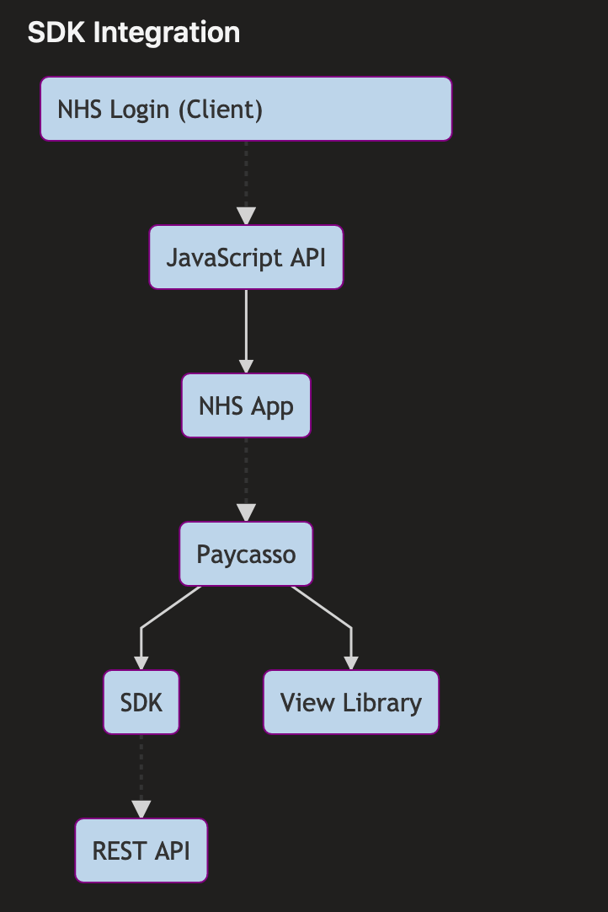
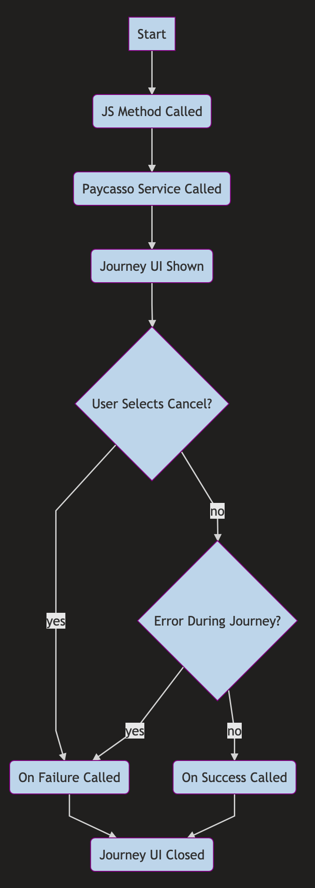

[[_TOC_]]

## Overview

Paycasso is a product which provides identity document capture, OCR and verification.

NHS Login use this to ingest picture's of passports, short confirmation videos etc. Historically this was done by sending data to the Paycasso REST API after it is captured.

The NHS app provides access to the Paycasso SDK. This is a library built for iOS and Android that allows using native controls to preform the capture and OCR of documents with better quality control.

We embed this SDK into our Android and iOS apps and expose it via a Javascript API that is available to a webpage being displayed inside the NHS App. This is restricted to NHS Login sites only, using the known services functionality to whitelist their hostname for the current environment.

This document details the SDK integration with the NHS App & the Javascript API.

## SDK Integration



The JavaScript API is connected to the NHS APP using a `Native Bridge` which allows Android/iOS to communicate with a embedded WebView.

The NHS App acts as a proxy between the JS API and the native Paycasso SDK.

Paycasso handles showing UI screens and managing the journey requested. If the Paycasso journey is successful it sends a message to the Paycasso REST API. The data uploaded here can be retrieved by NHS Login using their Paycasso API Client.

The Paycasso View Library is a custom library built by Paycasso for NHS Login that includes custom content and screens that will be shown to the user.

## Transaction Flow

Below is a diagram outlining how a NHS App + Paycasso transaction behaves.



## API Methods

This section lists the methods available in the JavaScript API.

**Notes:**

All methods listed here are stored in the `window.nativeNhsLogin` object. You do not have to source any external JavaScript files - as long as you are running the NHS Login page from within the NHS App this will be defined.

You must check that you are on a native device, otherwise the API methods will not be defined:

```javascript
  if (typeof window.nativeNhsLogin !== "Object") {
    // do something else since you are not on a native device
  }
```

----

### `startPaycasso`

Starts a Paycasso journey using the given configuration.

----

**Parameters:**

1. `Paycasso Launch Configuration` object (see [Data Models](#data-models))

**Returns:** Nothing

**Notes:**

This method requires you to define two callback methods inside the window object. The `window.authentication` object must be defined with two members: 

1. `paycassoOnSuccess`: Function which is called when the journey succeeds, it should accept one parameter - a JSON string containing a `Paycasso Response` object (see [Data Models](#data-models))
1. `paycassoOnFailure`: Function which is called when the journey fail, it should accept one parameter - a JSON string containing a `Paycasso Error` object (see [Data Models](#data-models))

**Example:**

```javascript
let config = {
  // paycasso launch config fields...
}

window.authentication = {
  paycassoOnSuccess: responseJson => {
    const response = JSON.parse(response)

    // do something with response
  },
  paycassoOnFailure: errorJson => {
    const error = JSON.parse(errorJson)

    // do something with error
  }
}

const configJson = JSON.stringify(request)

window.nativeNhsLogin.startPaycasso(configJson)
```

## Data Models

This section lists the different objects used as parameters in API methods and callbacks.

----

### Paycasso Launch Configuration

----

| Field                                   | Type    | Description                                                                     | Validation                                        |
|-----------------------------------------|---------|---------------------------------------------------------------------------------|---------------------------------------------------|
| credentials                             | Object  | Authentication config for the Paycasso API                                      | Must be non-null                                  |
| credentials.hostUrl                     | String  | Paycasso API URL                                                                | Must be a valid HTTP/HTTPS URL                    |
| credentials.token                       | String  | Paycasso API session token                                                      | Must be a non-empty string                        |
| externalReferences                      | Object  | Paycasso Config                                                                 | Must be non-null                                  |
| externalReferences.consumerReference    | String  | -                                                                               | Must be a non-empty string                        |
| externalReferences.transactionReference | String  | -                                                                               | Must be a non-empty string                        |
| externalReferences.appUserId            | String  | -                                                                               | Must be a non-empty string                        |
| externalReferences.deviceId             | String  | -                                                                               | Must be a non-empty string                        |
| externalReferences.hasNfcJourney        | Boolean | Do you want to attempt to scan an NFC chip in the journey? (biometric passport) | Must be present                                   |
| externalReferences.transactionType      | String  | The type of user journey                                                        | One of: `InstaSure`, `VeriSure` or `DocuSure`     |
| transactionDetails                      | Object  | User journey config                                                             | Must be non-null                                  |
| transactionDetails.documentType         | String  | The type of document being requested from the user                              | One of: `DriversLicence`, `Passport` or `PhotoId` |

----

### Paycasso Response

----

| Field           | Type    | Notes                                                                                                                           |
|-----------------|---------|---------------------------------------------------------------------------------------------------------------------------------|
| transactionId   | String  | -                                                                                                                               |
| transactionType | String  | One of: `InstaSure`, `VeriSure` or `DocuSure`                                                                                   |
| isFaceMatched   | Boolean | Did the face on the identify document match the users input? (video/picture taken with device) - Only meaningful for `VeriSure` journeys |

----

### Paycasso Error

----

| Field              | Type    | Notes                                    |
|--------------------|---------|------------------------------------------|
| error              | Object  | -                                        |
| error.errorCode    | Integer | Code for the type of error that occurred |
| error.errorMessage | String  | Human readable description of the error  |
