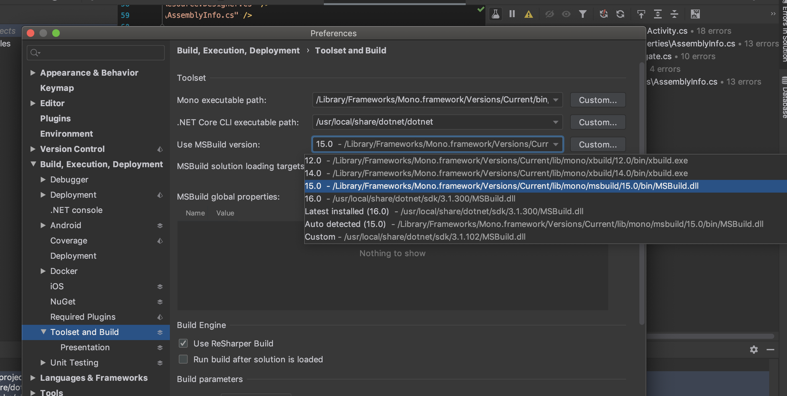

# Xamarin

## Environment Setup

### Windows

Install Xamarin "Mobile Develeopment .Net" using Visual Studio Install

### Mac

#### Rider

[Follow Getting started with Xamarin on Rider](https://www.jetbrains.com/help/rider/Xamarin.html#). This will require Visual Studio for Mac to be installed but not used

##### Troubleshooting

You may have to direct Rider to point at the specific Mono version that Xamarin forms requires.

